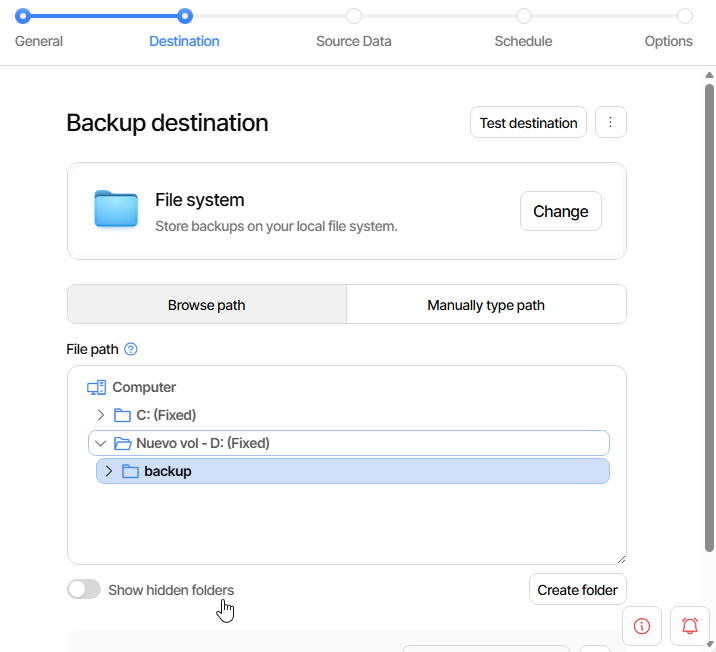
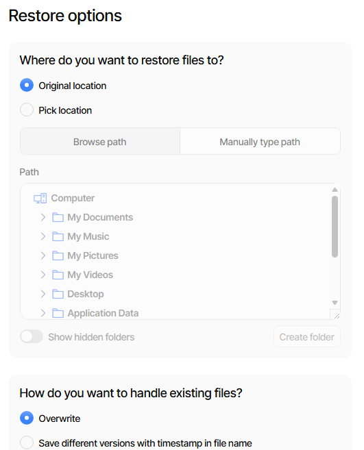
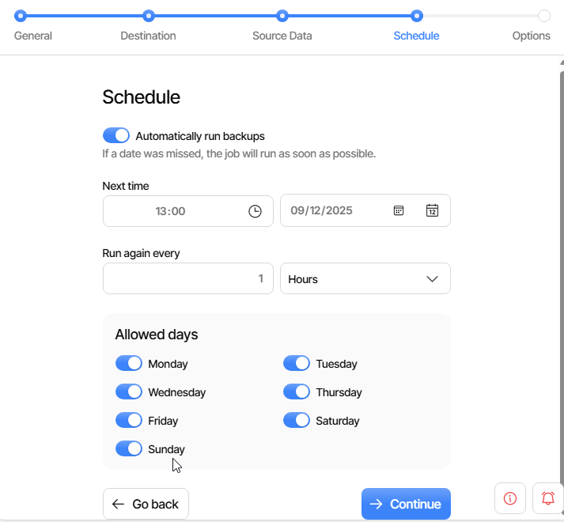
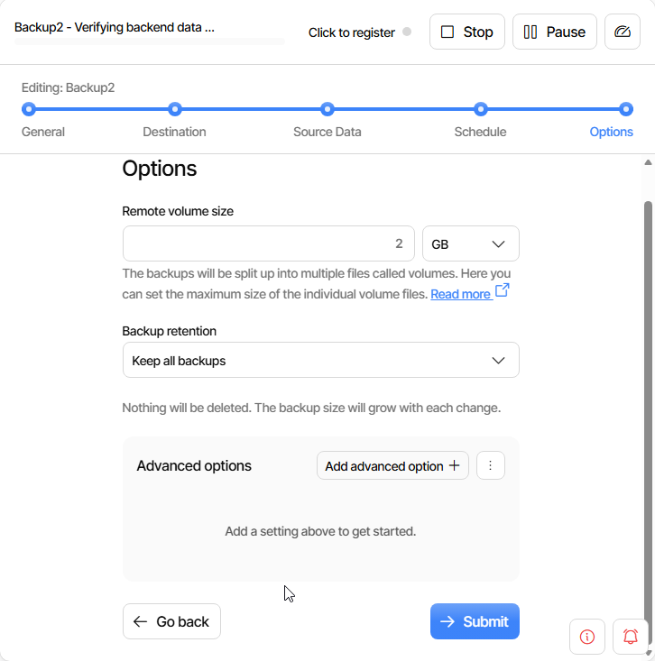

# **GUIA BACKUPS T02**
# windows11
## instalacio de duplicati
Entrem a la pagiaweb i iniciem sesio/crear un compte  

Descarregue el duplicati.setup

initzialitzem el duplicati.setup

## Configuracio
initzialitzar la aplicacio de duplicati i seleccionem la opcio de backups

1.Posem un nom i una contraseña al backup

2. seleccionem ha on voldrem guardar el backup 

3. Seleccionem de que volem fer el backup si de una carpeta o de tot el sistema

4. indeiquem cada cuant volem que faci els nous backups

5. seleccionem de quina mida es fara el backup i li donem a submit

## Backup
iniciem la aplicacio de duplicati iseleccionem la opcio de 

