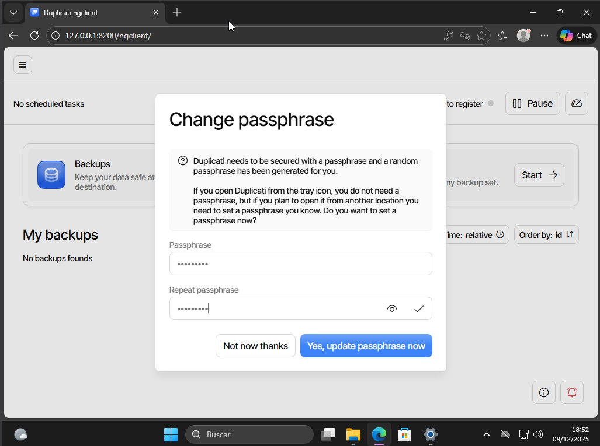
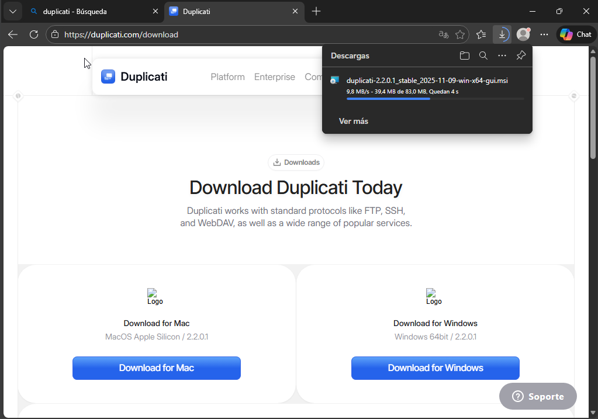
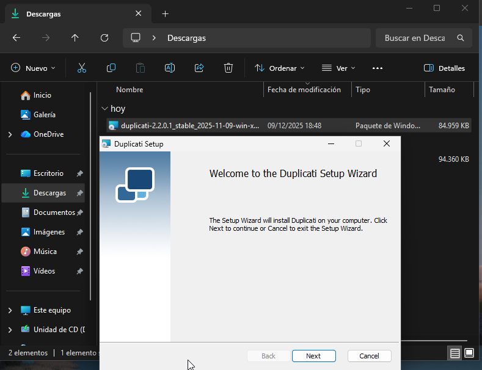
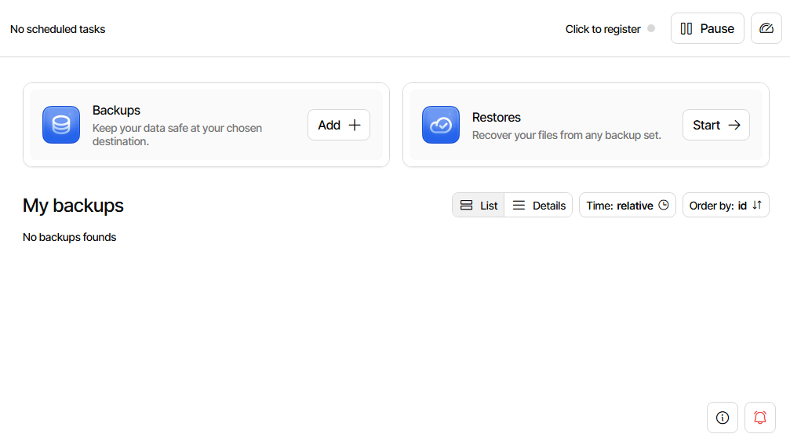
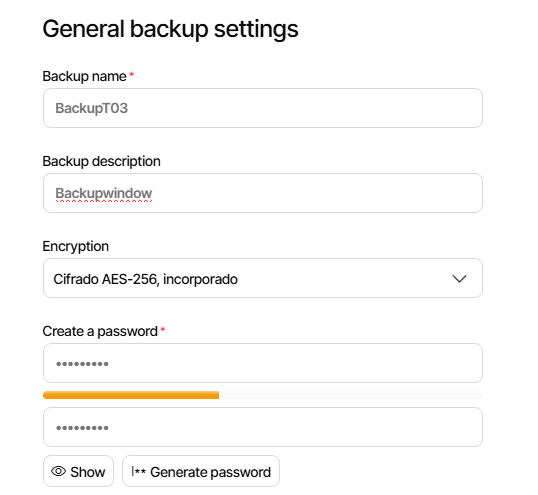

# GUIA BACKUPS T02

#instalacio de duplicati
Entrem a la pagiaweb i iniciem sesio/crear un compte  

Descarregue el duplicati.setup

initzialitzem el duplicati.setup

Configuracio
initzialitzar la aplicacio de duplicati i seleccionem la opcio de backups

1.Posem un nom i una contraseña al backup

