# **GUIA BACKUPS T02**
# Windows11
## Instalacio de duplicati
Entrem a la pagiaweb i iniciem sesio/crear un compte  

Descarregue el duplicati.setup

Initzialitzem el duplicati.setup

## Configuracio
Initzialitzar la aplicacio de duplicati i seleccionem la opcio de backups

1.Posem un nom i una contraseña al backup

2. Seleccionem ha on voldrem guardar el backup 

3. Seleccionem de que volem fer el backup si de una carpeta o de tot el sistema

4. Indeiquem cada cuant volem que faci els nous backups

5. Seleccionem de quina mida es fara el backup i li donem a submit

## Backup
Iniciem la aplicacio de duplicati iseleccionem la opcio de restore

Escollim quin backup volem initzialitzar (si tens mes d'un) i despres esperem a que el Backup termini
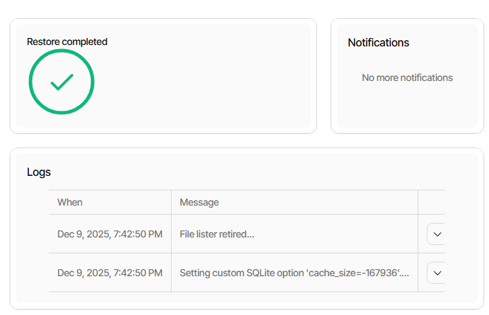

# Ubuntus
Inicialitzem i formatem el disc amb XFS
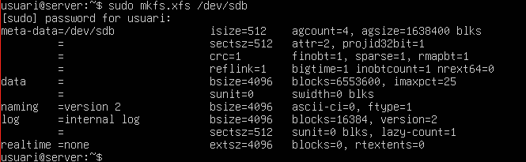

Creem la carpeta per muntar-lo

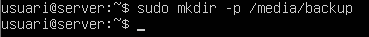

Muntem manualment el disc

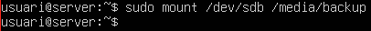

Comprovem que hem montat el disc

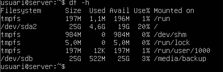

Instalem duplicity

Creem dos usuaris
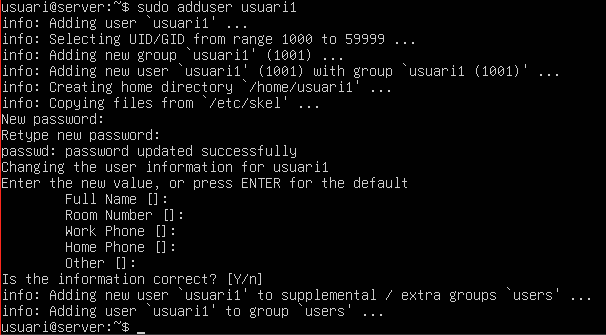
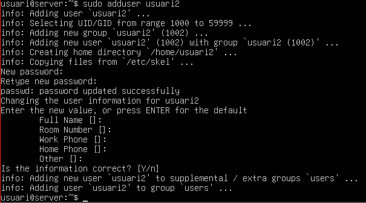

Creem 4 fitchers de 10 MB 
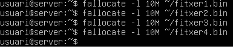

Crem el backup de les carpetes que em creat

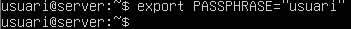
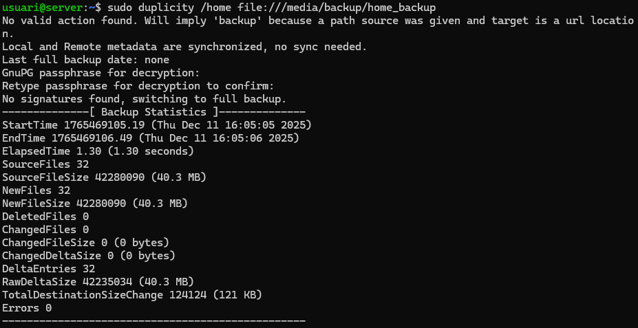

Borrem les 4 carpetas ateriors
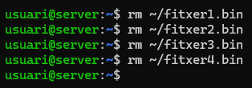

Fem el Buckup i comprovem que s'han recuperat

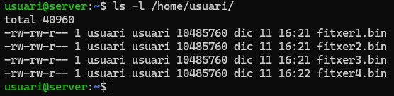

Creem un quint fitxer de 4 MB
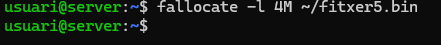

Fem una copia incremental

Posem aquest script en l'archiu fullbackup.sh

Donem permisos d'execucio a l'archiu

Programar còpia completa amb cron com a root

Afegim la seguent línia

Escrivim el seguent script a larchiu incrementalbackup.sh

Donem permisos d'execucio a l'archiu

Programar còpia incremental amb cron com a root

Afegim la seguent línia

