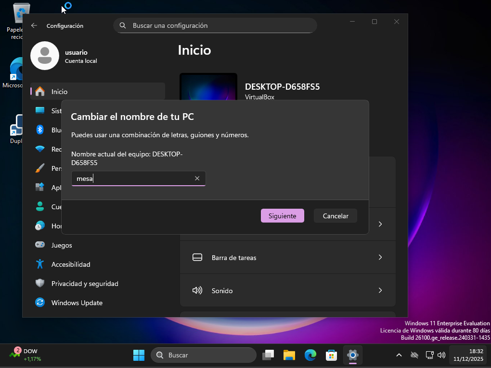
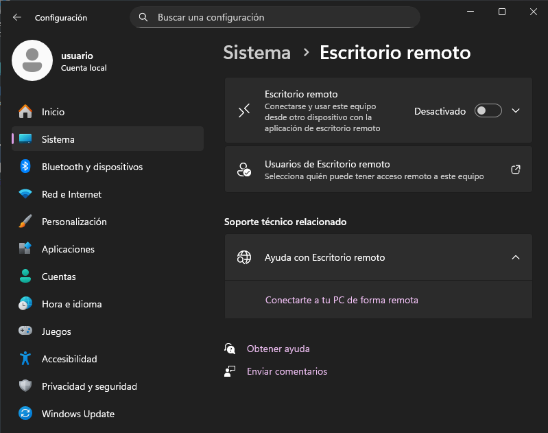
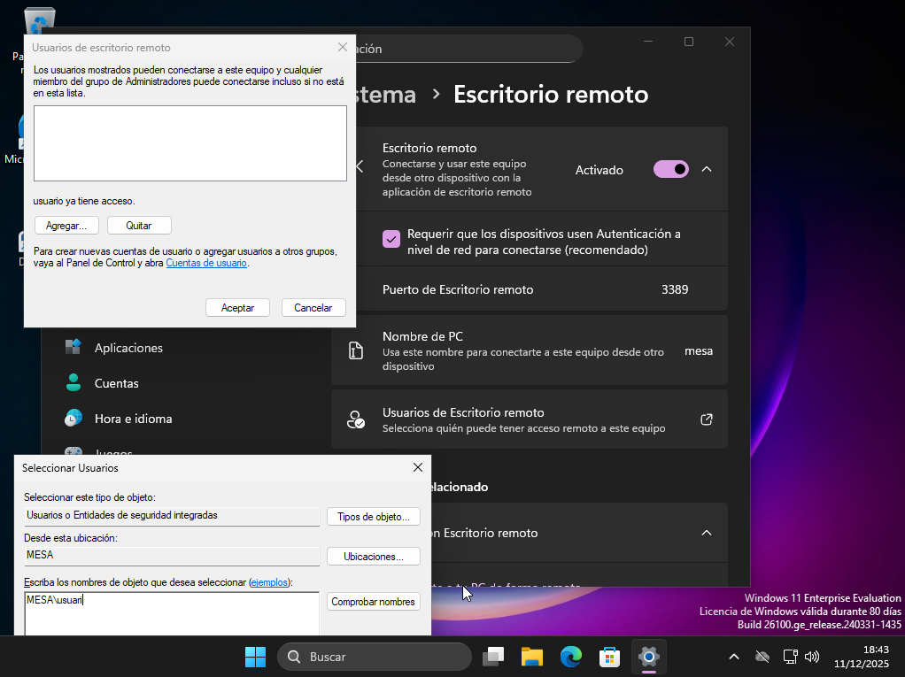
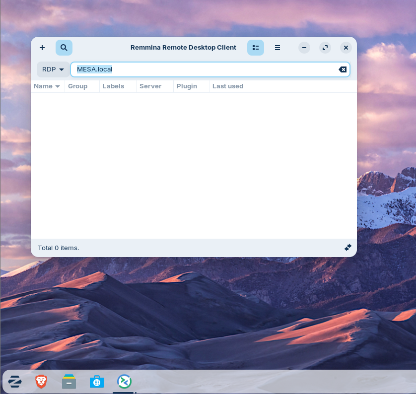
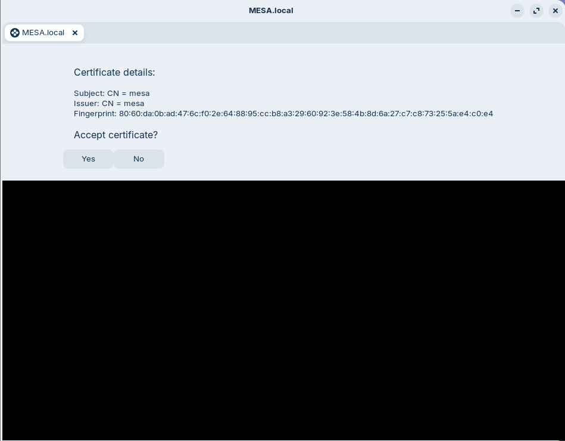
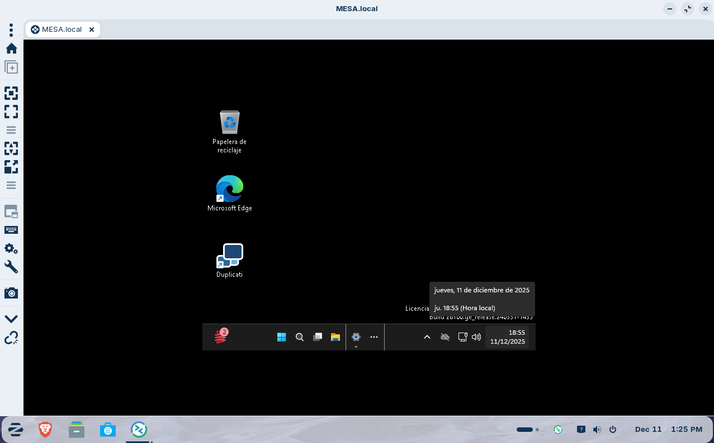

# T06: Accés remot. Escriptori remot (RDP) (tasca individual)
## iniceiarem en nel windows 11 i entrarem a configuracio on anirem a inici i canviarem el nom de la maquina

## Despres anirem a l'apartat de sistema, abilitarem la opcio de escritori remot i seleccionarem la opcio de usuari de escriptori remot

## sortira una finestra on tindrem que clicar en afegir i fara que surti un altre finestra i per ultim afegire *Nom_de_la_maquina\nom_del_usuari*, despres de tot aixo accepte

## iniciarem amb zorin i obrirem la aplicacio Remmina i ficarem el *nom_de_la_maquina_windows.local*

## despres esperem a que es conecti i clicarem en la opcio *yes* i per ultim iniciarem sesio

