# Guia d'Exercicis: Projecte04 Servidor NFS

Aquesta guia resumeix els passos i proves descrits al README original del projecte.

---

## Fase 1: Preparació de l’entorn
**Objectiu:** Crear dues màquines virtuals Linux.

**Accions:**
- Servidor: Ubuntu Server 24.04 LTS (instal·lar SSH).
- Client: Zorin OS 18.
- Configurar dues interfícies de xarxa: NAT (Internet) i Host-only (comunicació interna).
- Actualitzar els sistemes i verificar connexió entre màquines.

---

## Fase 2: Preparació del servidor
**Objectiu:** Configurar usuaris, grups i directoris.

**Accions:**
- Crear grups: `devs` i `admins`.

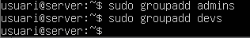

  
- Crear usuaris: `dev01` (grup devs) i `admin01` (grup admins).

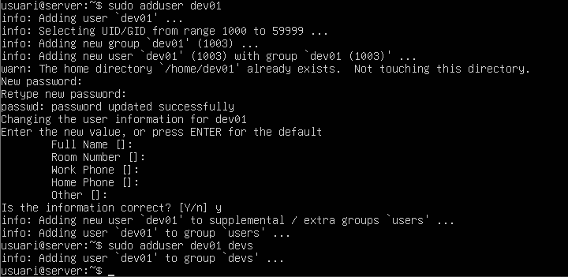
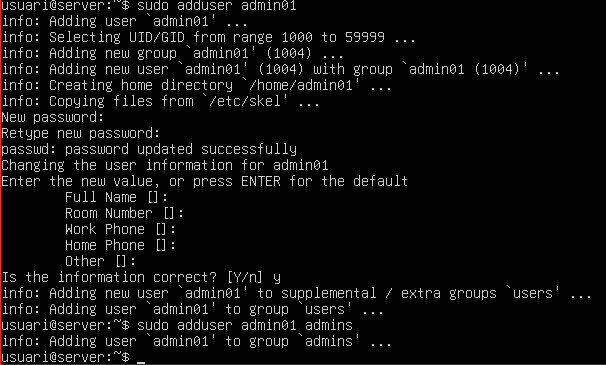

- Crear directoris:
  - `/srv/nfs/dev_projects`
  - `/srv/nfs/admin_tools`

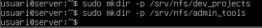

    
- Assignar permisos:
  - Developers → control total sobre `dev_projects`.
  - Administradors → control sobre `admin_tools`.
  - Propietari: `root`.
 
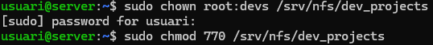
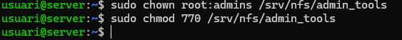

- Instal·lar paquets NFS i configurar `/etc/exports`.

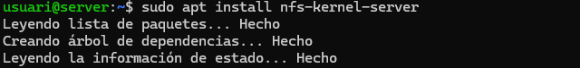
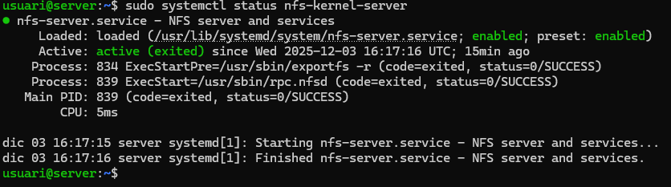
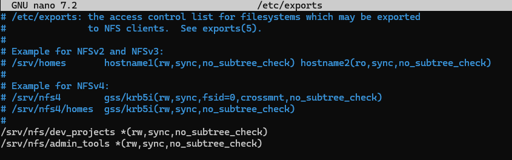

---

## Fase 3: Exportació d’Administració (root_squash)
**Prova 1 (Error comú):**
- Exportar `/srv/nfs/admin_tools` amb `rw,sync`.

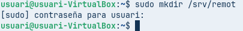

- Muntar al client: `/mnt/admin_tools`.

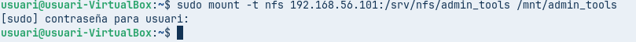

  
- Crear fitxer com a root i comprovar propietari.

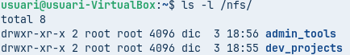
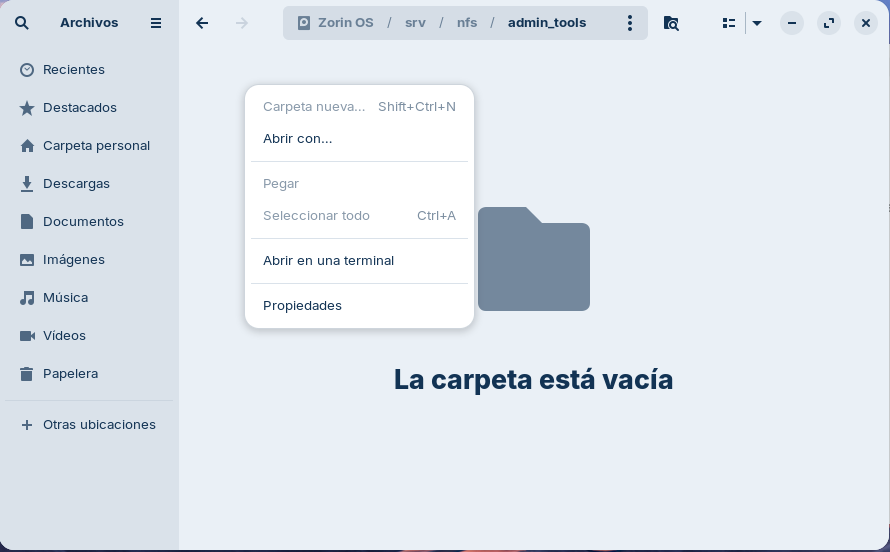

**Prova 2 (Solució):**
- Afegir opció `no_root_squash` a l’exportació.

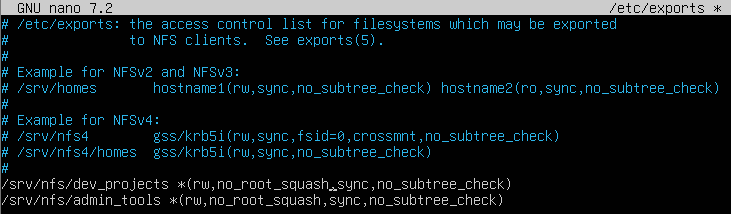

  
- Desmuntar i tornar a muntar.

  
- Crear fitxer com a root i justificar el canvi.

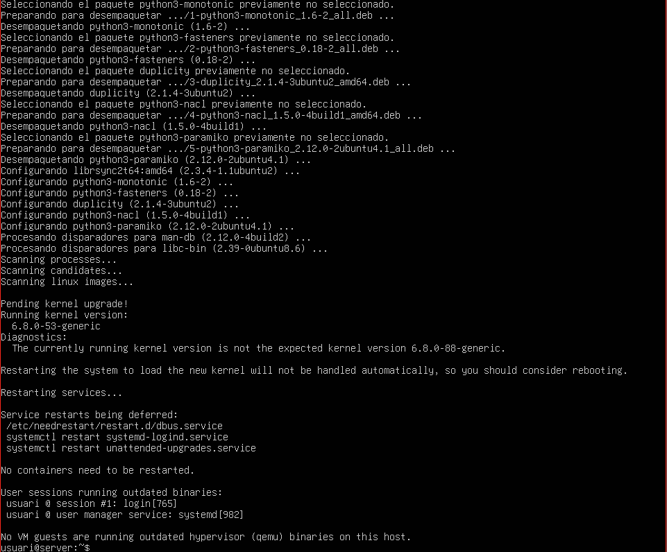

---

## Fase 4: Exportació de Desenvolupament (rw vs ro)
**Objectiu:** Controlar permisos segons IP.

**Accions:**
- Configurar `/etc/exports` amb:
  - Xarxa admins (192.168.56.0/24) → `rw`.
  - IP consultors (192.168.56.100) → `ro`.
- Muntar `/mnt/dev_projects` i provar:
  - Escriure com `dev01` (funciona).
  - Canviar IP a 192.168.56.100 → només lectura.
  - Canviar usuari a `admin01` → no pot escriure (permisos locals).

---

## Fase 5: Muntatge automàtic amb `/etc/fstab`
**Objectiu:** Automatitzar muntatge.

**Accions:**
- Editar `/etc/fstab` per afegir entrades NFS.
- Executar `mount -a` per provar.
- Reiniciar i verificar muntatge automàtic.

---

## Conclusió
- Redactar recomanacions per millorar la solució:
  - Autenticació centralitzada.
  - Gestió d’usuaris i permisos més robusta.
  - Seguretat en NFS (xifrat, firewalls, etc.).

---

**Com lliurar la tasca:**
- Documenta cada fase amb comandes en format codi.
- Inclou captures de pantalla.
- Respon les preguntes tècniques (root_squash, permisos).
- Escriu una conclusió raonada amb millores.
